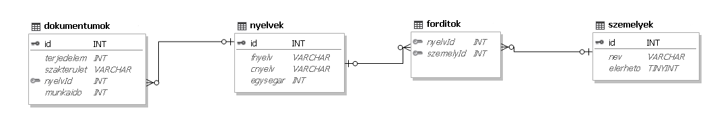

# Adatb-zis_2024_Csapat4

# Fordítóiroda

Futtassa le a **iroda.sql** állományt az alábbi táblák(`dokumentumok`, `nyelvek`, `forditok`) létrehozásához!

**1. Készítsen új adatbázist iroda néven! A mellékelt állományokat importálja az adatbázisba**
**a fájlnévvel azonos táblanéven! Az állományok tabulátorral tagolt, UTF-8 kódolású**
**szövegfájlok, az első soruk a mezőneveket tartalmazza. Állítsa be a megfelelő típusokat és**
**a kulcsokat!**

## Táblák:

|**dokumentumok**| (id, terjedelem, szakterulet, nyelvid, munkaido)      |
|:--------------:|:--------:                                             |
|`id `           | A fordítandó dokumentum azonosítója (szám), ez a kulcs|
|`terjedelem`    | A dokumentum karaktereinek száma (szám)               |
|`szakterulet`   |  A dokumentum szakterülete (szöveg)                   |
|`nyelvid`       | A forrás- és a célnyelv párok azonosítója (szám)      |
|`munkaido`      |  A fordítás elvégzésére becsült idő órában (szám)     |
 
 

|**nyelvek**| (id, fnyelv, cnyelv, egysegar)                                 |
|:---------:|:--------:                                                      |
|`id`       | A fordítási nyelvpár azonosítója (szám), ez a kulcs            |
|`fnyelv`   | A forrás dokumentum nyelve (szöveg)                            |
|`cnyelv`   | A cél dokumentum nyelve (szöveg)                               |
|`egysegar` |5000 karakternél nem hosszabb fordítás ára adott nyelvpár esetén|
 
 

|**forditok**|(nyelvid, szemelyid)                                                                        |  
|:---------:|:--------:                                                                                  |                                
|`nyelvid`  | Annak a nyelvpárnak az azonosítója, amit a fordító vállal (szám), az összetett kulcs része |
|`szemelyid`|          A fordító azonosítója (szám), az összetett kulcs része                            |
 
 

|**szemelyek**|(id, nev, elerheto)                                |
|:------:   |:--------:                                         |
|`id`       | A fordító azonosítója (szám), ez a kulcs          |
|`nev`      | A fordító neve (szöveg) – azonos nevűek nincsenek |
|`elerheto` |  A fordító aktuális munkaképessége (logikai)      |
 
 

 
 

**2. A fordítóiroda utólag vállalt egy új nyelvről való fordítást. Adja hozzá a nyelvek adattáblához a következőket. Az id legyen 145, forrás nyelve török, a cél dokumentum nyelve román, illetve az egységár pedig legyen 3000Ft.**

.PNG>)
.PNG>)
 
 

**3. A személyek adattáblában elírtak egy nevet. Módosítsa Nagy Tímea nevét Kiss Tímeára.**

   .PNG>)
   .PNG>)
    
    

**4. A dokumentumok táblában történt egy tévedés, és a rendszerbe valamilyen módon bekerült a 25-ös id-val rendelkező sport szakterületű dokumentum. Keresse meg és törölje ki az adattáblából.**

   .PNG>)
   .PNG>)
    
    

**5. Készítsen lekérdezést, amely ábécérendben megjeleníti azoknak a fordítóknak a nevét, akik új munkát tudnak vállalni!**

.PNG>)
.PNG>)
 
 

**6. Készítsen lekérdezést, amely meghatározza az 5000 és az annál kisebb karakterszámú dokumentumok számát és az ezek fordításáért járó összbevételt!**

.PNG>)
.PNG>)
 
 

**7. Készítsen lekérdezést, amely megadja az angolról magyarra fordítandó dokumentumok terjedelmét és szakterületét! A lista terjedelem szerint csökkenően jelenjen meg!**

.PNG>)
.PNG>)
 
 

**8. Melyik szakterülethez tartoznak és melyik nyelvről melyikre kell azokat a dokumentumot fordítani, amelyekre majdnem pontosan egy munkanapnyi (7-9 óra) fordítási időt becsültek? Adja meg lekérdezés segítségével a szakterületeket, a forrás- és a célnyelvek nevét a forrásnyelv szerint ábécé sorrendben!**

.PNG>)
.PNG>)
 
 

**9. Lekérdezés segítségével adja meg azoknak a fordítóknak a nevét, akik magyarról a legtöbb célnyelvre vállalnak fordítást! Több ilyen fordító esetén elegendő egyet megjeleníteni.**
 

.PNG>)
.PNG>)
 
 

**11. Készítsen lekérdezést, amely kilistázza szakterületenként, hogy melyik nyelvről melyikre kell fordítani a megrendelt dokumentumokat. A listát szakterületenként csoportosítsa és azon belül minden nyelvpár egyszer jelenjen meg a forrásnyelv szerint ábécé-rendben! A lekérdezés elkészítésekor a mintából a mezők sorrendjét, a címet és a mezőnevek megjelenítését vegye figyelembe! A jelentés formázásában a mintától eltérhet.**

.PNG>)
.PNG>)
 
 